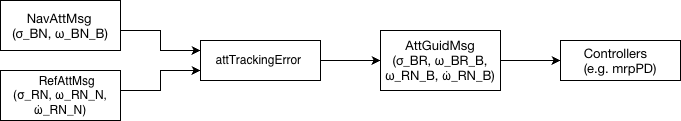

===========================
Attitude Tracking Error
===========================
-----------------
Executive Summary
-----------------

The Attitude Tracking Error module computes the attitude and rate errors between the spacecraft body frame and a desired reference frame.
It reads in the current spacecraft attitude and angular velocity from navigation message and the desired reference attitude, angular velocity, and angular acceleration from a reference message. The output of the module is the attitude and angular velocity errors expressed in the spacecraft body frame.
This module is intended to be the last stage in the guidance chain, where it can feed into the controller modules such as :ref:`mrpPD` controller.

-------------------------------
Module Input/Output Messages
-------------------------------

The following table lists all the module input and output messages:

.. list-table:: Module I/O Messages
    :widths: 25 25 50
    :header-rows: 1

    * - Msg Variable Name
      - Msg Type
      - Description
    * - attGuidOutMsg
      - :ref:`AttGuidMsgF32Payload`
      - Attitude guidance tracking errors output message
    * - attNavInMsg
      - :ref:`NavAttMsgF32Payload`
      - Attitude navigation input message
    * - attRefInMsg
      - :ref:`AttRefMsgF32Payload`
      - Attitude reference input message

-------------------------------
Module Functions
-------------------------------

Below is a list of operations that this module performs:

- Reads the incoming attitude navigation and attitude reference messages
- Converts the message C arrays to Eigen vectors to perform mathematical operations
- Computes the attitude tracking error between the spacecraft body and reference frames
- Transforms the reference angular velocity to body frame components
- Computes the angular velocity tracking error
- Transforms the reference angular velocity and acceleration to body frame components
- Converts the Eigen outputs back to C arrays for the output payload
- Writes the guidance module output message to be used by downstream FSW modules

-------------------------------
Module Architecture
-------------------------------

The `attTrackingError` module is structured to have two different layers:

1. Adapter layer (FSW interface)

2. Algorithm layer (pure mathematical operations)

The algorithm represents the pure mathematical logic of the module, while the adapter handles the simulation framework interface.

**1.Adapter Layer**

The adapter allows for FSW interface and it's responsible of:

- Initializing the module by checking that input messages are properly linked using `reset()` function
- Constructing the algorithm from a validated `AttTrackingErrorConfig` in `reset()` (two-phase initialization)
- Reporting an error condition and preventing module execution in case of unlinked input messages
- Reading the input messages (`attNavInMsg`, `attRefInMsg`)
- Converting the message C arrays to Eigen vectors
- Adding inputs into structs (`AttNavInput` and `AttRefInput`)
- Calling the attitude tracking error algorithm `AttTrackingErrorAlgorithm`
- Converting outputs back to C arrays
- Write the attitude guidance output message `attGuidOutMsg`

**2.Algorithm Layer**

The algorithm performs the core mathematical computations and it is designed to be separated from the FSW messaging framework. It operates using the input and output float structs (`AttNavInput`, `AttRefInput`, and `AttGuidOutput`) defined in the algorithm header `attTrackingErrorAlgorithm.h`. The algorithm has no tunable parameters, so its `AttTrackingErrorConfig` carries no state; it exists for lifecycle uniformity and is built once per `reset()`.

-------------------------------------
Input Constraints and Assumptions
-------------------------------------

- The module does not enforce bounds on the inputs
- Modified Rodrigues Parameters (MRPs) are assumed to represent valid rotations (:math:`\|\boldsymbol{\sigma}\| \leq 1`)
- The navigation angular velocity input is expressed in the spacecraft body frame (:math:`^{B}\omega_{BN}`)
- The reference angular velocity and acceleration are expressed in the inertial frame (:math:`^{N}\omega_{RN}`, :math:`^{N}\dot{\omega}_{RN}`)
- The navigation and reference attitudes are defined relative to the same inertial frame

-------------------------------
Mathematical Formulation
-------------------------------

**1. Attitude tracking error**

The attitude tracking error  is computed using Modified Rodrigues Parameters (MRP) subtraction:

:math:`\mathbf{\sigma}_{BR} = \text{subMRP}(\mathbf{\sigma}_{BN}, \mathbf{\sigma}_{RN})`

**2. Reference angular velocity transformation**

The reference angular velocity is transformed from inertial to body frame components using:

:math:`{}^{B}\boldsymbol{\omega}_{RN} = \mathbf{[BN]} \, {}^{N}\boldsymbol{\omega}_{RN}`

where :math:`\mathbf{[BN]}` is the direction cosine matrix derived from :math:`\boldsymbol{\sigma}_{BN}`.

**3. Angular velocity tracking error**

The angular velocity error is computed as the difference between the body and reference rate:

:math:`{}^{B}\boldsymbol{\omega}_{BR} = {}^{B}\boldsymbol{\omega}_{BN} - {}^{B}\boldsymbol{\omega}_{RN}`

**4. Reference angular acceleration Transformation**

The reference angular acceleration is transformed from inertial to body frame components using:

:math:`{}^{B}\dot{\boldsymbol{\omega}}_{RN} = \mathbf{[BN]} \, {}^{N}\dot{\boldsymbol{\omega}}_{RN}`

Overall, ``attTrackingError`` provides consistent body frame tracking error quantities for downstream attitude control laws.

-------------------------------
Module Interaction Diagram
-------------------------------

The diagram illustrates how the module acts as a bridge to connect between navigation and control systems. It takes the current spacecraft attitude and angular velocity from the navigation message and the desired attitude, angular velocity, and angular acceleration from the reference message. It then computes the attitude and angular velocity tracking errors expressed in the body frame and outputs them in the guidance message. These outputs are then used by downstream control modules (e.g. mrpPD).

   Attitude Tracking Error Module Diagram

----------
User Guide
----------

The module is configured by::

    attitudeTrackingError = attTrackingError.AttTrackingError()
    attitudeTrackingError.modelTag = "attTrackingError"

This documentation provides sufficient details for engineers to use the algorithm without further context.
