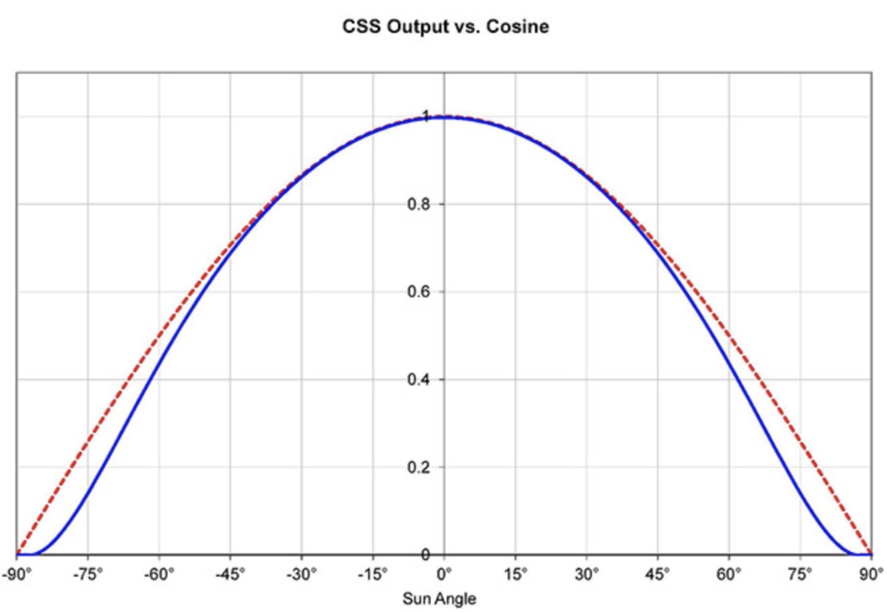

.. raw:: latex

    {\LARGE \textbf{cssComm}}

Executive Summary
-----------------
This module corrects raw Coarse Sun Sensor (CSS) output values to expected cosine values using a pre-calibrated
Chebyshev residual model. The residual model maps a normalized raw CSS measurement to the expected deviation
from the ideal cosine response. Each sensor measurement is normalized by a configurable maximum sensor value,
corrected using the Chebyshev polynomial series, and clamped to the range [0, 1].

Message Connection Descriptions
-------------------------------
The following table lists all the module input and output messages.  The module msg connection is set by the
user from python.  The msg type contains a link to the message structure definition, while the description
provides information on what this message is used for.

.. list-table:: Module I/O Messages
    :widths: 20 30 50
    :header-rows: 1

    * - Msg Variable Name
      - Msg Type
      - Description
    * - sensorListInMsg
      - :ref:`CSSArraySensorMsgF32Payload`
      - input message containing raw CSS sensor data
    * - cssArrayOutMsg
      - :ref:`CSSArraySensorMsgF32Payload`
      - output message of corrected CSS cosine values

Module Parameters
-------------------------------
The following table lists all the module parameters that can be set. All parameters are required and must be
configured before the module is used.

.. list-table:: Module Parameters
    :widths: 40 20 10 10 30 30
    :header-rows: 1

    * - Parameter Name
      - Type
      - Units
      - Default
      - Description
      - Bounds
    * - numSensors (required)
      - uint32_t
      - [-]
      - 0
      - Number of CSS sensors in the constellation
      - Must be in [1, MAX_NUM_CSS_SENSORS] (validated when the config is built in ``reset()``)
    * - maxSensorValue (required)
      - double
      - [-]
      - 0
      - Maximum raw sensor output value used to normalize measurements
      - Must be finite and positive (validated when the config is built in ``reset()``)
    * - chebyCount (required)
      - uint32_t
      - [-]
      - 0
      - Number of Chebyshev polynomial coefficients to use
      - Must be in [1, MAX_NUM_CHEBY_POLYS] (validated when the config is built in ``reset()``)
    * - chebyPolynomials (required)
      - std::array<double, MAX_NUM_CHEBY_POLYS>
      - [-]
      - all zeros
      - Pre-calibrated Chebyshev polynomial coefficients :math:`C_i`
      - All coefficients must be finite

Module Assumptions and Limitations
-----------------------------------
- The Chebyshev residual function is calibrated to a single distance from the sun. As the spacecraft moves
  farther from the calibration distance, the model loses accuracy. These discrepancies grow increasingly
  apparent at high sun angles.
- The module assumes ``maxSensorValue`` is representative of the actual peak sensor output. If this value is
  incorrect, the normalization and subsequent correction will be inaccurate.
- The Chebyshev correction is applied independently to each sensor. No cross-sensor coupling is modeled.

Initialization
--------------
The module is configured by::

    module = cssCommF32.CssComm()
    module.modelTag = "cssComm"
    module.numSensors = num_sensors
    module.maxSensorValue = max_sensor_value
    module.chebyCount = len(cheby_list)
    padded = cheby_list + [0.0] * (MAX_NUM_CHEBY_POLYS - len(cheby_list))
    module.chebyPolynomials = cssCommF32.DoubleArrayCheby(padded)

The ``chebyPolynomials`` array must contain exactly ``MAX_NUM_CHEBY_POLYS`` (11) entries; pad the calibrated
coefficient list with trailing zeros (which are inert in the Chebyshev sum). All configuration parameters must be
set before ``reset()`` is called, at which point the module builds and validates its immutable configuration
(raising on invalid values).

Detailed Module Description
---------------------------

Algorithm Flow
^^^^^^^^^^^^^^
At every update cycle, the ``cssComm`` module performs the following steps for each of the ``numSensors``
sensor measurements:

1. **Normalize** the raw sensor reading by ``maxSensorValue``:

   .. math::

      x_{\text{meas}} = \frac{\text{raw}_i}{\text{maxSensorValue}}

2. **Compute the Chebyshev correction** :math:`\delta x` using the pre-calibrated coefficients:

   .. math::

      \delta x = \sum_{j=0}^{N} C_j \, T_j(x_{\text{meas}})

3. **Apply the correction** to the normalized measurement:

   .. math::

      x_{\text{corr}} = x_{\text{meas}} + \delta x

4. **Clamp** the corrected value to the valid cosine range:

   .. math::

      x_{\text{out}} = \text{clamp}(x_{\text{corr}},\; 0,\; 1)

Sensor indices beyond ``numSensors`` are left at zero in the output message.

   Example of CSS output (blue) relative to a cosine curve (red)

Equations
^^^^^^^^^

Residual Function
~~~~~~~~~~~~~~~~~

The correction applied to each CSS measurement is based on a function
that maps a raw CSS measurement to the expected cosine response for that
measurement (i.e. the distance from the red curve to the blue curve in
the figure above). This function is modeled using a Chebyshev
polynomial series to the :math:`N`-th order represented by the following
form:

.. math::

   \delta x = \sum_{i=0}^{N} C_i \, T_i(x_{\text{meas}})

where :math:`T_i(x)` represents the Chebyshev polynomials, and
:math:`C_i` are the pre-determined scaling factors.

This correction to the raw measurement is then applied using:

.. math::

   x_{\text{corr}} = x_{\text{meas}} + \delta x

Chebyshev Polynomial Computation
~~~~~~~~~~~~~~~~~~~~~~~~~~~~~~~~

The procedure to compute the Chebyshev polynomials, :math:`T_i(x)`, is
as follows:

#. Suppose we want to evaluate the Chebyshev polynomial of order :math:`i`
   at :math:`x_0`, denoted :math:`T_i(x_0)`.

#. The first two orders of Chebyshev polynomials are evaluated using
   the following form:

   .. math::

      T_0(x) = 1

   .. math::

      T_1(x) = x

#. The Chebyshev polynomial of order :math:`i > 1` can be computed using
   the values of Chebyshev polynomials of order :math:`i-1` and
   :math:`i-2` and the following recursive formula:

   .. math::

      T_{i+1}(x) = 2x \, T_i(x) - T_{i-1}(x)

#. Apply this formula up to order :math:`i` to evaluate the Chebyshev
   polynomial of order :math:`i` at :math:`x_0`.

Output Clamping
~~~~~~~~~~~~~~~
After the Chebyshev correction is applied, the result is clamped to the range [0, 1]. This ensures
that the corrected output represents a valid cosine value. Clamping handles edge cases such as:

- Negative raw sensor readings (e.g. sensor noise) that would produce negative corrected values.
- Sensor readings above ``maxSensorValue`` whose scaled value exceeds 1.0 after correction.
