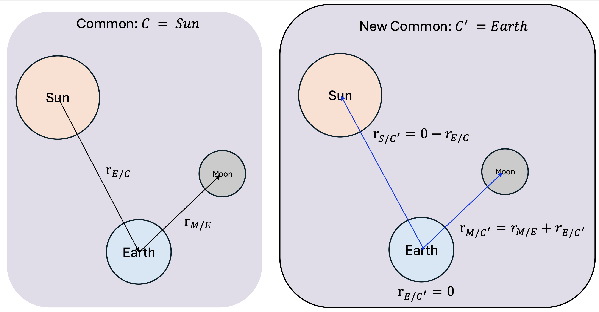

Ephemerides Recenter
=============================

This module provides functionality to transform the ephemerides of a collection of bodies
so that they are expressed relative to a new central body, rather than their original reference (e.g., Sun or Earth).
Positions and velocities are computed in double precision; the ``EphemerisMsgF32Payload`` messages it reads and writes
also carry double-precision ``r_BdyZero_N`` / ``v_BdyZero_N`` fields.

Assumptions and Limitations
---------------

The module should be used in the following circumstances: when creating a simulation with ephemeris tables mostly all
generated with respect to a central body like the Sun or Earth, but with the spacecraft table in the simulation
centered on one of these bodies. This module allows to recenter all the bodies around the desired central body.

The module works with planets around the Sun, and with a single moon around one of those planets. Furthermore all
of the bodies must be relative to the original zero base, except one moon per body if applicable (in which case the
moon is relative to its parent body).

Module Overview
---------------

The module is split into two layers:

- ``EphemeridesRecenter`` (adapter): owns the per-body input/output messages and the build/query API. Each body is
  registered with ``addBodyEphemerisToRecenter``, which also creates that body's output message.
- ``EphemeridesRecenterAlgorithm`` (algorithm): the pure recentering math. It is constructed from a validated
  ``EphemeridesRecenterConfig`` and exposes ``updateState``.

When building a body with the ``BodyEphemeris`` class, set:

- ``bodySpiceId``: the SPICE ID of the body
- ``originalCentralBodyId``: the SPICE ID of the body's original zero-base (of the input message data)
- ``inputEphemerisMsg``: subscribe it to the body's input ephemeris message
- add it to the module with ``addBodyEphemerisToRecenter``

When setting up the module:

- ``setNewZeroBase``: the SPICE ID of the new zero base the spacecraft (and all other bodies) switch to
- ``setPreviousCommonZeroBase``: the SPICE ID of the previous common zero base

Two-phase initialization: all bodies and both zero bases are set first; then ``reset()`` builds and validates the
immutable ``EphemeridesRecenterConfig`` (rejecting an unknown new central body, an orphan moon, a moon-of-moon, or
more than one moon per parent) and constructs the algorithm. ``updateState()`` raises if called before ``reset()``.

-------------------------------
Module Input/Output Messages
-------------------------------

.. list-table:: Module I/O Messages
    :widths: 35 30 50
    :header-rows: 1

    * - Msg Variable Name
      - Msg Type
      - Description
    * - ``BodyEphemeris::inputEphemerisMsg`` (one per body)
      - :ref:`EphemerisMsgF32Payload`
      - input ephemeris for a body, expressed about its original central body
    * - ``recenteredEphemerisOutputMsgs[i]``
      - :ref:`EphemerisMsgF32Payload`
      - recentered ephemeris for body ``i``, expressed about the new central body (created per body added)

Algorithm Logic
-------------
- Step 1: obtain the ephemeris of the requested new central body with respect to the previous common zero :math:`r_{newC/C}`. If the new central body is a moon :math:`r_{newC/C}=r_{newC/Parent}+r_{Parent/C}`.
- Step 2: for each non-moon body :math:`b_i`, compute their ephemeris relative to the new central body :math:`r_{b_i/newC}=r_{b_i/C} - r_{newC/C}`.
- Step 3: for each non-moon body :math:`b_i` that has a moon, compute its ephemeris relative to the new central body :math:`r_{m/newC}=r_{m/Parent}+r_{Parent/newC}`

Illustration Figure
-------------

   Illustrating the algorithm logic by Sun-Earth-Moon.

Usage Example
-------------

Below is an example of configuring the module from Python:

.. code-block:: python

    from xmera.fp32 import ephemeridesRecenterF32
    from xmera.architecture import messaging

    module = ephemeridesRecenterF32.EphemeridesRecenter()
    module.modelTag = "ephemeridesRecenter"

    # Build and register each body; addBodyEphemerisToRecenter creates that body's output message.
    earthBody = ephemeridesRecenterF32.BodyEphemeris()
    earthBody.bodySpiceId = EARTH_ID
    earthBody.originalCentralBodyId = SUN_ID
    earthBody.inputEphemerisMsg.subscribeTo(earthInputMessage)
    module.addBodyEphemerisToRecenter(earthBody)
    # ... register the remaining bodies the same way ...

    # Set both zero bases before reset() (the simulation calls reset() at initialization).
    module.setPreviousCommonZeroBase(SUN_ID)
    module.setNewZeroBase(MARS_ID)

    # After execution, each body's recentered output is available by registration index:
    recorder = module.recenteredEphemerisOutputMsgs[index].recorder()

Notes
-----
\- The maximum number of bodies is limited to 20.
