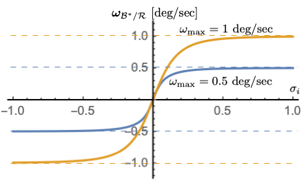
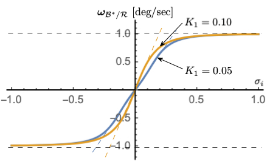
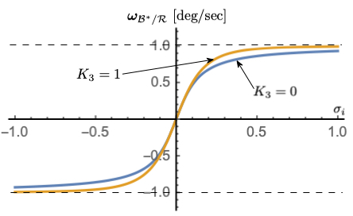

.. raw:: latex

    {\LARGE \textbf{mrpSteering}}

Executive Summary
-----------------
The intend of this module is to implement an MRP attitude steering law with a maximum angular rate of the spacecraft
with respect to the reference frame. The module determines and outputs the control torque vector on the spacecraft.

Message Connection Descriptions
-------------------------------
The following table lists all the module input and output messages.  The module msg connection is set by the
user from python.  The msg type contains a link to the message structure definition, while the description
provides information on what this message is used for.

.. list-table:: Module I/O Messages
    :widths: 30 30 50
    :header-rows: 1

    * - Msg Variable Name
      - Msg Type
      - Description
    * - guidInMsg
      - :ref:`AttGuidMsgPayload`
      - attitude guidance input message
    * - vehConfigInMsg
      - :ref:`VehicleConfigMsgPayload`
      - vehicle configuration input message
    * - rwSpeedsInMsg
      - :ref:`RWSpeedMsgPayload`
      - (optional) RW speed input message
    * - rwAvailInMsg
      - :ref:`RWAvailabilityMsgPayload`
      - (optional) RW availability input message
    * - rwParamsInMsg
      - :ref:`RWArrayConfigMsgPayload`
      - (optional) RW configuration parameter input message
    * - cmdTorqueOutMsg
      - :ref:`CmdTorqueBodyMsgPayload`
      - commanded torque output message

Module Parameters
-------------------------------
The following table lists all the module parameters than can be set. The parameters are optional unless indicated
(if not specified default is used).

.. list-table:: Module Parameters
    :widths: 60 30 30 30
    :header-rows: 1

    * - Parameter Name
      - Default
      - Description
      - Bounds
    * - K1
      - 0
      - Proportional gain applied to MRP errors
      - Must not be negative (checked in setter)
    * - K3
      - 0
      - Cubic gain applied to MRP errors
      - Must not be negative (checked in setter)
    * - omegaMax (required)
      - 0
      - Maximum rate command of steering control
      - Must be greater than zero (checked in setter)
    * - ignoreOuterLoopFeedforward
      - false
      - Indicates if feedforward term should be included
      - N/A
    * - P
      - 0
      - Rate error feedback gain
      - Must not be negative (checked in setter)
    * - Ki
      - 0
      - Integral feedback gain
      - Must not be negative (checked in setter). If 0, no integral feedback is applied and the corresponding computation is skipped
    * - integralLimit
      - 0
      - Limit for integral feedback term (term will be capped by integralLimit)
      - Must not be negative (checked in setter)
    * - knownTorquePntB_B
      - [0, 0, 0]
      - Known external torque in body frame components
      - None
    * - controlPeriod
      - 0
      - control period (1/fsw_rate)
      - Must be greater than 0

Module Assumptions and Limitations
----------------------------------
This control assumes the spacecraft is rigid and that the control gains of the attitude control (P, Ki) are chosen such
that the decay time is much faster than that of the body rate computation (K1, K3).

Initialization
--------------
The module is configured by::

    module = mrpSteering.MrpSteering()
    module.modelTag = "mrpSteering"
    module.K1 = K1
    module.K3 = K3
    module.omegaMax = omega_max
    module.P = P
    module.Ki = Ki
    module.integralLimit = integral_limit
    module.knownTorquePntB_B = known_torque

If the feed-forward term should be ignored::

    module.ignoreOuterLoopFeedforward = True

Detailed Module Description
---------------------------
The following text describes the mathematics behind the ``mrpSteering`` module.  Further information can also be
found in the journal paper `Speed-Constrained Three-Axes Attitude Control Using Kinematic Steering
<http://dx.doi.org/10.1016/j.actaastro.2018.03.022>`_.

Overview
^^^^^^^^
This module computes a commanded control torque vector :math:`\mathbf L_r`
using a rate based steering law that drives a body frame
:math:`{\mathcal B} :\{ \hat{\mathbf B}_{1}, \hat{\mathbf B}_{2}, \hat{\mathbf B}_{3}\}`
towards a time varying reference frame
:math:`{\mathcal R} :\{ \hat{\mathbf R}_{1}, \hat{\mathbf R}_{2}, \hat{\mathbf R}_{3}\}`,
based on a desired reference frame
:math:`{\mathcal B\ast} :\{ \hat{\mathbf B}_{1}, \hat{\mathbf B}_{2}, \hat{\mathbf B}_{3}\}`
(the desired body frame from the kinematic steering law).

The output message is a body-frame
control torque vector. The required attitude guidance message
contains both attitude tracking error rates as well as reference frame
rates. This message is read in with every update cycle. The vehicle
configuration message is only read in on reset and contains the
spacecraft inertia tensor about the vehicle’s center of mass location.
The commanded body rates are read in from the steering module output
message.

The reaction wheel (RW) configuration message is optional. If the
message name is specified, then the RW message is read in,
otherwise the inertia of the wheels is not considered. If the
optional RW availability message is present, then the control will only
use the RWs that are marked available.

The servo rate feedback control can compensate for Reaction Wheel (RW)
gyroscopic effects as well. This is an optional input message where the
RW configuration array message contains the RW spin axis
:math:`\hat{g}_{s,i}` information and the RW polar inertia about the
spin axis IWs,i . This is only read in on reset. The RW speed message
contains the RW speed :math:`\Omega_i` and is read in every time step.
The optional RW availability message can be used to include or not
include RWs in the MRP feedback. This allows the module to selectively
turn off some RWs. The default is that all RWs are operational and are
included.

Steering Law Goals
^^^^^^^^^^^^^^^^^^
The goal of MRP Steering is to drive a body frame
:math:`{\mathcal B} :\{ \hat{\mathbf B}_{1}, \hat{\mathbf B}_{2}, \hat{\mathbf B}_{3}\}`
towards a time varying reference frame
:math:`{\mathcal R} :\{ \hat{\mathbf R}_{1}, \hat{\mathbf R}_{2}, \hat{\mathbf R}_{3}\}`.
The inertial frame is given by
:math:`{\mathcal N} :\{ \hat{\mathbf N}_{1}, \hat{\mathbf N}_{2}, \hat{\mathbf N}_{3}\}`.
The RW coordinate frame is given by
:math:`\mathcal{W_{i}}:\{ \hat{\mathbf g}_{s_{i}}, \hat{\mathbf g}_{t_{i}}, \hat{\mathbf g}_{g_{i}} \}`.
Using MRPs, the overall control goal is

.. math::

       \mathbf\sigma_{\mathcal{B}/\mathcal{R}} \rightarrow 0

The attitude error :math:`\mathbf\sigma_{\mathcal{B}/\mathcal{R}}` is provided by an upstream module such as
:ref:`attTrackingError`.
The reference frame orientation
:math:`\mathbf \sigma_{\mathcal{R}/\mathcal{N}}`, angular velocity
:math:`\mathbf\omega_{\mathcal{R}/\mathcal{N}}` and inertial angular
acceleration :math:`\dot{\mathbf \omega}_{\mathcal{R}/\mathcal{N}}` are
assumed to be known.

MRP Steering Law
^^^^^^^^^^^^^^^^
To create a kinematic steering law, let :math:`{\mathcal{B}}^{\ast}` be the desired body orientation,
and :math:`\mathbf\omega_{{\mathcal{B}}^{\ast}/\mathcal{R}}` be the desired angular velocity vector of
this body orientation relative to the reference frame :math:`\mathcal{R}`.  The steering law requires
an algorithm for the desired body rates :math:`\mathbf\omega_{{\mathcal{B}}^{\ast}/\mathcal{R}}`
relative to the reference frame.

The desired body rate is computed by

.. math::

	{}^{B}{\mathbf\omega}_{{\mathcal{B}}^{\ast}/\mathcal{R}} = - {\mathbf f}(\mathbf\sigma_{\mathcal{B}/\mathcal{R}})

where :math:`{\mathbf f}(\mathbf\sigma)` is an even function

.. math::

	 f( \sigma_{i}) = \arctan \left(
		(K_{1} \sigma_{i} +K_{3} \sigma_{i}^{3}) \frac{ \pi}{2  \omega_{\text{max}}}
	\right) \frac{2 \omega_{\text{max}}}{\pi}

and with

.. math::

    \mathbf\sigma_{\mathcal{B}/\mathcal{R}} = (\sigma_{1}, \sigma_{2}, \sigma_{3})^{T}

and

.. math::

	{\mathbf f}(\mathbf\sigma_{\mathcal{B}/\mathcal{R}}) = \begin{bmatrix}
		f(\sigma_{1})\\ f(\sigma_{2})\\ f(\sigma_{3})
		\end{bmatrix}

The required velocity servo loop design is aided by knowing the body-frame derivative of
:math:`{}^{B}{\mathbf\omega}_{{\mathcal{B}}^{\ast}/\mathcal{R}}` to implement a feed-forward component.
Using the :math:`{\mathbf f}()` function definition, this requires the time
derivatives of :math:`f(\sigma_{i})`.

.. math::

    \frac{{}^{B}{\text{d} ({}^{B}{\mathbf\omega}_{{\mathcal{B}}^{\ast}/\mathcal{R}} ) }}{\text{d} t} =
    {\mathbf\omega}_{{\mathcal{B}}^{\ast}/\mathcal{R}} '
    = - \frac{\partial {\mathbf f}}{\partial \mathbf\sigma_{{\mathcal{B}}^{\ast}/\mathcal{R}}} \dot{\mathbf\sigma}_{{\mathcal{B}}^{\ast}/\mathcal{R}}
    = - \left[ \begin{matrix}
        \frac{\partial  f}{\partial  \sigma_{1}} \dot{ \sigma}_{1} \\
		\frac{\partial  f}{\partial  \sigma_{2}} \dot{ \sigma}_{2} \\
		\frac{\partial  f}{\partial  \sigma_{3}} \dot{ \sigma}_{3}
    \end{matrix} \right]

where

.. math::
    \dot{\mathbf\sigma}	_{{\mathcal{B}}^{\ast}/\mathcal{R}} =
    \left[ \begin{matrix}
        \dot\sigma_{1}\\
		\dot\sigma_{2}\\
		\dot\sigma_{3}
    \end{matrix} \right] =
    \frac{1}{4}[B(\mathbf\sigma_{{\mathcal{B}}^{\ast}/\mathcal{R}})]
    {}^{B}{\mathbf\omega}_{{\mathcal{B}}^{\ast}/\mathcal{R}}

Using the :math:`f()` definition, its sensitivity with respect to :math:`\sigma_{i}` is

.. math::
    \frac{
		\partial f
	}{
		\partial \sigma_{i}
	} =
    \frac{
	(K_{1}  + 3 K_{3} \sigma_{i}^{2})
	}{
	1+(K_{1}\sigma_{i} + K_{3} \sigma_{i}^{3})^{2} \left(\frac{\pi}{2 \omega_{\text{max}}}\right)^{2}
	}

If ignoreOuterLoopFeedforward == true, then :math:`{\mathbf\omega}_{{\mathcal{B}}^{\ast}/\mathcal{R}} ' = 0` and the
computation of the feed-forward component is skipped.

   :math:`\omega_{\text{max}}` dependency with :math:`K_{1} = 0.1`, :math:`K_{3} = 1`

    :math:`K_{1}` dependency with :math:`\omega_{\text{max}}` = 1 deg/s, :math:`K_{3} = 1`

    :math:`K_{3}` dependency with :math:`\omega_{\text{max}}` = 1 deg/s, :math:`K_{1} = 0.1`

Figures 1-3 illustrate how the parameters :math:`\omega_{\text{max}}`, :math:`K_{1}` and :math:`K_{3}`
impact the steering law behavior.  The maximum steering law rate commands are easily set through the
:math:`\omega_{\text{max}}` parameters.  The gain :math:`K_{1}` controls the linear stiffness when
the attitude errors have become small, while :math:`K_{3}` controls how rapidly the steering law
approaches the speed command limit.

Rotational Dynamics
^^^^^^^^^^^^^^^^^^^
The rotational equations of motion of a rigid spacecraft with :math:`N`
Reaction Wheels (RWs) attached are given by

.. math::

       [I_{RW}] \dot{\mathbf \omega} = - [\tilde{\mathbf \omega}] \left(
       [I_{RW}] \mathbf\omega + [G_{s}] \mathbf h_{s}
       \right) - [G_{s}] \mathbf u_{s} + \mathbf L

where the inertia tensor :math:`[I_{RW}]` is defined as

.. math::

       [I_{RW}] = [I_{s}] + \sum_{i=1}^{N} \left (J_{t_{i}} \hat{\mathbf g}_{t_{i}} \hat{\mathbf g}_{t_{i}}^{T} + J_{g_{i}} \hat{\mathbf g}_{g_{i}} \hat{\mathbf g}_{g_{i}}^{T}
       \right)

The spacecraft inertia without the :math:`N` RWs is :math:`[I_{s}]`,
while :math:`J_{s_{i}}`, :math:`J_{t_{i}}` and :math:`J_{g_{i}}` are the
RW inertias about the body fixed RW axis :math:`\hat{\mathbf g}_{s_{i}}` (RW
spin axis), :math:`\hat{\mathbf g}_{t_{i}}` and :math:`\hat{\mathbf g}_{g_{i}}`.
The :math:`3\times N` projection matrix :math:`[G_{s}]` is then defined
as

.. math::

        [G_{s}] =
        \begin{bmatrix}
            \cdots {\hat{\mathbf g}}_{s_{i}} \cdots
        \end{bmatrix}

The RW inertial angular momentum vector :math:`\mathbf h_{s}` is defined as

.. math::

       h_{s_{i}} = J_{s_{i}} (\omega_{s_{i}} + \Omega_{i})

Here :math:`\Omega_{i}` is the :math:`i^{\text{th}}` RW spin relative to
the spacecraft, and the body angular velocity is written in terms of
body and RW frame components as

.. math::

       \mathbf\omega = \omega_{1} \hat{\mathbf b}_{1} + \omega_{2} \hat{\mathbf b}_{2} + \omega_{3} \hat{\mathbf b}_{3}
       = \omega_{s_{i}} \hat{\mathbf g}_{s_{i}} +  \omega_{t_{i}} \hat{\mathbf g}_{t_{i}} +  \omega_{g_{i}} \hat{\mathbf g}_{g_{i}}

Angular Velocity Servo Sub-System
^^^^^^^^^^^^^^^^^^^^^^^^^^^^^^^^^

To implement the kinematic steering control, a servo sub-system is
included which will produce the required torques to make the actual body
rates track the desired body rates. The angular velocity tracking error
vector is defined as

.. math::

       \delta \mathbf \omega = \mathbf\omega_{\mathcal{B}/\mathcal{B}^{\ast}} = \mathbf\omega_{\mathcal{B}/\mathcal{N}} - \mathbf\omega_{\mathcal{B}^{\ast}/\mathcal{N}}

where the :math:`\mathcal{B}^{\ast}` frame is the desired body frame
from the kinematic steering law. Note that

.. math::

    \mathbf\omega_{\mathcal{B}^{\ast}/\mathcal{N}} =  \mathbf\omega_{\mathcal{B}^{\ast}/\mathcal{R}} +  \mathbf\omega_{\mathcal{R}/\mathcal{N}}

where :math:`\mathbf\omega_{\mathcal{R}/\mathcal{N}}` is obtained from the
attitude navigation solution, and
:math:`\mathbf\omega_{\mathcal{B}^{\ast}/\mathcal{R}}` is the kinematic
steering rate command. To create a rate-servo system that is robust to
unmodeld torque biases, the state :math:`\mathbf z` is defined as:

.. math::

       \mathbf z = \int_{t_{0}}^{t_{f}} { \delta\mathbf\omega} \textrm{d}t

Let :math:`[P]^{T} = [P]` be a symmetric positive definite rate
feedback gain matrix. The servo rate feedback control is defined as

.. math::

   \begin{gathered}
       [G_{s}]\mathbf u_{s} = [P]\delta\mathbf\omega + [K_{I}]\mathbf z - [\tilde{\mathbf\omega}_{\mathcal{B}^{\ast}/\mathcal{N}}]
       \left( [I_{\text{RW}}] \mathbf\omega_{\mathcal{B}/\mathcal{N}} + [G_{s}] \mathbf h_{s} \right)
       \\
       - [I_{\text{RW}}](\mathbf\omega_{\mathcal{B}^{\ast}/\mathcal{R}} ' +  \dot{\mathbf\omega}_{\mathcal{R}/\mathcal{N}} -  {\mathbf\omega}_{\mathcal{B}/\mathcal{N}} \times  \mathbf\omega_{\mathcal{R}/\mathcal{N}}) + \mathbf L
   \end{gathered}

Defining the right-hand-side as :math:`- \mathbf L_{r}`, this is rewritten in
compact form as

.. math:: [G_{s}]\mathbf u_{s} = -\mathbf L_{r}

The :ref:`mrpSteering` module writes the control torque :math:`\mathbf L_{r}` to the :ref:`CmdTorqueBodyMsgPayload`
output message.

Downstream, the :ref:`rwMotorTorque` module can then be used to compute the array of RW motor torques by solving the
typical minimum norm inverse:

.. math:: \mathbf u_{s} = [G_{s}]^{T}\left( [G_{s}][G_{s}]^{T}\right)^{-1} (- \mathbf L_{r})

Additional Information
----------------------
The value of ``integralLimit``, used to limit the degree of integrator
windup and reduce the chance of controller saturation. The integrator
is required to maintain asymptotic tracking in the presence of an
external disturbing torque. For this module, the integration limit is
applied to each element of the integrated error vector :math:`z`, and
any elements greater than the limit are set to the limit instead.
