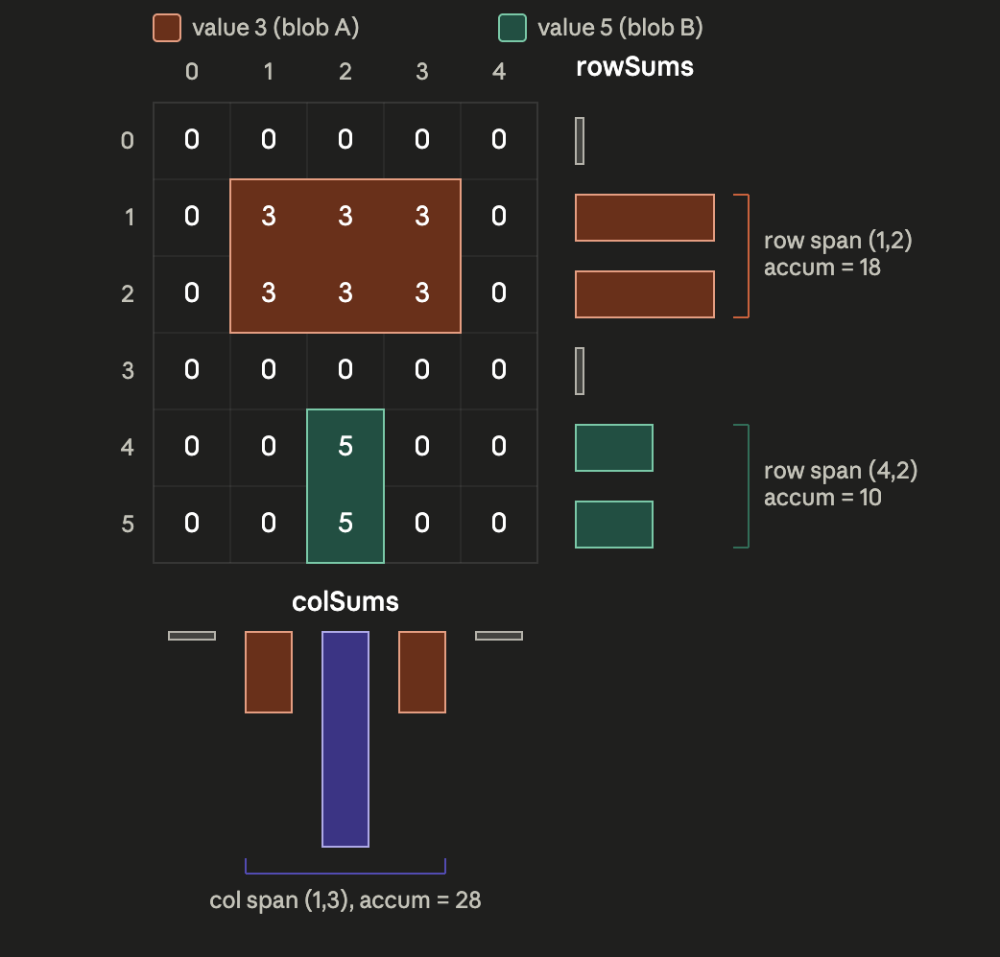
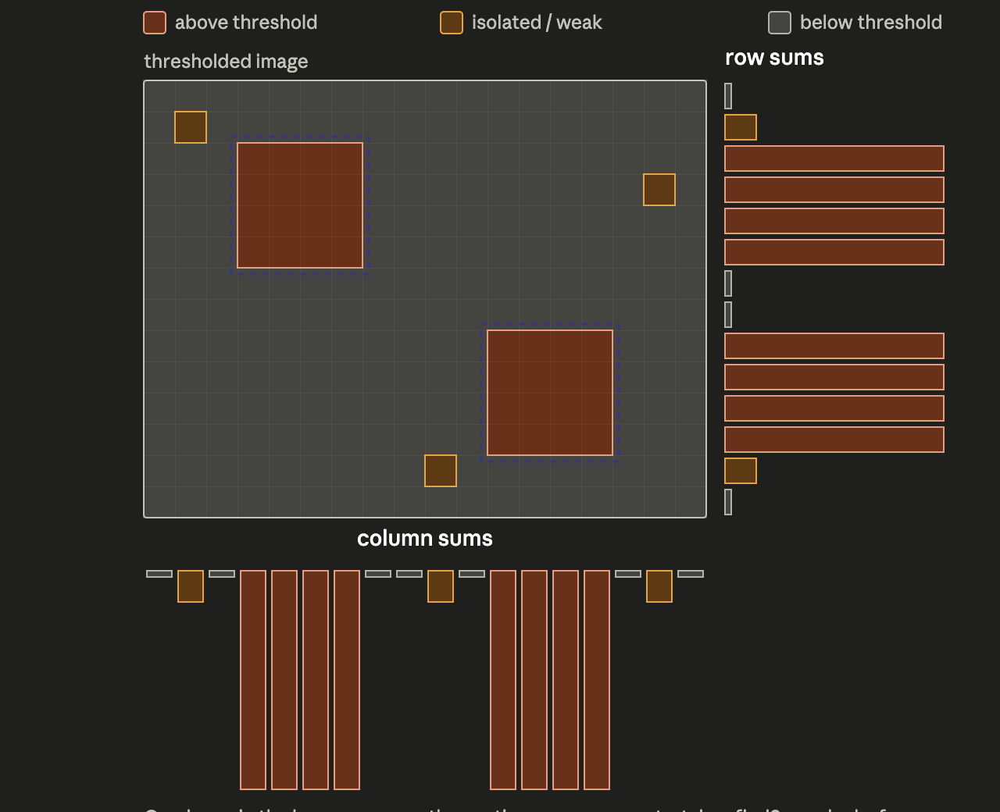

.. raw:: latex

    {\LARGE \textbf{regionsOfInterestPrune}}

Executive Summary
=================

``RegionsOfInterestPrune`` consumes the row/column above-threshold pixel sums produced by
``fpgaImagePipeline`` and publishes up to ``MAX_NUMBER_REGIONS`` bounding-box candidates, sorted by
estimated pixel count, for downstream tracking or centroiding stages. It is an **FP32** module: all
internal math runs in ``float``, not ``double``, matching the flight target's precision.

The module is split into two classes:

* ``RegionsOfInterestPruneAlgorithm`` — pure C++, no xmera messaging dependencies. Accepts raw
  ``uint16_t`` row/col sum arrays (as a ``std::span``) and returns an internal ``RoiCandidates``
  struct of up to ``ROI_CANDIDATES_MAX`` candidates.
* ``RegionsOfInterestPrune`` — thin xmera adapter. Reads ``FpgaRowColSumMsgF32Payload``, delegates
  computation to ``RegionsOfInterestPruneAlgorithm``, converts the top ``MAX_NUMBER_REGIONS``
  candidates to center-coordinate form, and writes the result to ``regionsIdentified​OutMsg``.

Pipeline stages::

    rowColSumInMsg
         |
         v
    1. Find spans        --  Find every unbroken run of non-zero values in the list,
                                and for each one, record its position, its length,
                                and the total of its values
         |
         v
    2. Pre-filter        --  keep only the top maxRowSpans row spans, top maxColSpans
                                col spans (ranked by sum)

         |
         v
    3. Build candidates  --  form a box from each row/col pair and use the smaller sum
                                as a safe estimate
         |
         v
    4. Sort & truncate   --  rank by count, then closeness to center, then size; keep
                                top ROI_CANDIDATES_MAX
         |
         v
    regionsIdentifiedOutMsg
        (top <= MAX_NUMBER_REGIONS of those, in center-coordinate form)

Algorithm Layer
================

This section describes ``RegionsOfInterestPruneAlgorithm``'s pure math it never sees a message
payload, a ``float``/``int`` cast for publication, or the adapter's ``MAX_NUMBER_REGIONS`` cap. Its
job ends at producing up to ``ROI_CANDIDATES_MAX`` (16) ranked candidates in corner-coordinate form
(top-left ``row``/``col`` plus ``height``/``width``).

**Step 1: span detection and accumulation**

A *span* is a maximal contiguous run of non-zero entries in a 1-D sum array. Each row span
``(r, h)`` and col span ``(c, w)`` marks the start and length of a group of image rows or columns
that contain at least one above-threshold pixel. The per-span accumulator sum ``R[k]`` (or ``C[l]``)
is computed in the same single forward pass as span detection, up to a hard cap of ``MAX_SPANS``
(128) stored spans per axis any further spans found beyond that cap are still scanned past, just not stored.

**Step 2: candidate filtering**

If every row span were paired with every column span, the number of combinations could grow very
large as the image becomes more complex. To keep the computation manageable, the module keeps only
the strongest ``maxRowSpans`` row spans (ranked by their sums, ``R[k]``) and the strongest
``maxColSpans`` column spans (ranked by ``C[l]``). Pairing these reduced sets limits the total number
of candidates to at most ``maxRowSpans × maxColSpans``, regardless of image size.

This is safe because the best rank-1 candidate is always formed by the row span with the highest sum
and the column span with the highest sum. Since both are always included in the reduced sets, the
best candidate is never discarded.

**Step 3: cross-product and pixel count estimation**

Every combination of a filtered row span ``k`` and a filtered col span ``l`` defines a bounding box
candidate ``(r, h, c, w)`` where ``r`` / ``h`` are the start row and height from span ``k``, and
``c`` / ``w`` are the start column and width from span ``l``. The estimated pixel count for each box
is:

* ``R[k]`` = sum of ``rowSums`` over row span ``k`` overcounts pixels outside col span ``l``
* ``C[l]`` = sum of ``colSums`` over col span ``l`` overcounts pixels outside row span ``k``
* ``count = min(R[k], C[l])`` — the tightest upper bound obtainable from 1-D projections alone. The
  true count may be lower, but never higher

**Step 4 — sort and truncate**

All candidates from Step 3 are ranked by three keys, in order:

#. ``count``, (descending), higher estimated pixel count ranks first.
#. Squared distance from the candidate's box center to the image center (``numRows/2``,
   ``numCols/2``), (ascending) on a ``count`` tie, the candidate closer to the image center ranks
   first. Squared (rather than true Euclidean) distance is used because only the ordering matters,
   so the ``sqrt`` is skipped.
#. Window area (``height × width``), (ascending) on a ``count`` and distance tie, the smaller box
   ranks first.

If the number of candidates exceeds ``ROI_CANDIDATES_MAX`` (16), the tail is dropped. The final list
is packed into an ``RoiCandidates`` struct with ``candidates[0]`` as rank-1.

Adapter Layer
==============

``RegionsOfInterestPrune`` follows this codebase's two-phase init lifecycle:

* ``reset()`` startup only. Validates ``rowColSumInMsg`` is linked, builds a validated
  ``RegionsOfInterestPruneConfig`` from the public ``maxRowSpans``/``maxColSpans`` properties, and
  constructs the algorithm. Does not read a message or seed any state.
* ``reconfigure()`` pushes a freshly-rebuilt config into the already-constructed algorithm,
  without reconstructing it. Throws if called before ``reset()``.
* ``updateState()`` reads ``rowColSumInMsg``, casts its raw ``void*`` row/col sum pointers to
  ``const uint16_t*``, calls the algorithm's ``update()``, and converts each surviving candidate
  from corner-coordinate form (``row``, ``col``, ``height``, ``width``) to the message's
  center-coordinate form (``centerX = col + width/2``, ``centerY = row + height/2``).

**Truncation to the message's capacity.** The algorithm may return up to ``ROI_CANDIDATES_MAX`` (16)
candidates, but ``RegionsIdentified​MsgF32Payload`` only has room for ``MAX_NUMBER_REGIONS`` (3). The
adapter publishes ``min(candidates.numCandidates, MAX_NUMBER_REGIONS)`` i.e. only the top 3 of the
algorithm's up-to-16 ranked candidates ever reach the published message; the rest are computed
internally (as part of Step 2's pre-filter safeguard) but never published.

Message Connection Descriptions
================================

.. list-table:: Module I/O Messages
    :widths: 27 48 25
    :header-rows: 1

    * - Msg Variable Name
      - Msg Type
      - Description
    * - rowColSumInMsg
      - ``FpgaRowColSumMsgF32Payload``
      - Per-row and per-column above-threshold pixel counts from ``fpgaImagePipeline``, plus the raw
        ``void*`` pointers to the underlying ``uint16_t`` sum arrays and the image dimensions
        (``numRows``, ``numCols``).
    * - regionsIdentified​OutMsg
      - ``RegionsIdentified​MsgF32Payload``
      - Up to ``MAX_NUMBER_REGIONS`` (3) candidates in center-coordinate form, sorted by estimated
        pixel count (ties broken by distance to image center, then box area). Index 0 is rank-1.

Config Parameters
==================

.. list-table:: Public config properties (set before ``reset()``)
    :widths: 20 15 15 50
    :header-rows: 1

    * - Property
      - Type
      - Default
      - Valid range
    * - ``maxRowSpans``
      - ``uint32_t``
      - 3
      - ``> 0`` — number of top row spans kept by the Step 2 pre-filter.
    * - ``maxColSpans``
      - ``uint32_t``
      - 3
      - ``> 0`` — number of top col spans kept by the Step 2 pre-filter.

Both properties are validated together by ``RegionsOfInterestPruneConfig::create()`` — an invalid
value (0) throws at ``reset()``/``reconfigure()`` time rather than silently misbehaving.

User Guide
==========

#. Import the module::

    from xmera.fp32 import regionsOfInterestPruneF32

#. Instantiate and configure (Phase 1 before ``reset()``)::

    pruner = regionsOfInterestPruneF32.RegionsOfInterestPrune()
    pruner.ModelTag = "roiPrune"

    # Optional: tune the pre-filter safeguard (defaults: 3 each)
    pruner.maxRowSpans = 10
    pruner.maxColSpans = 10

#. Connect to the upstream pipeline::

    pruner.rowColSumInMsg.subscribeTo(pipeline.rowColSumOutMsg)

#. Add to simulation task (this triggers ``reset()``)::

    sim.AddModelToTask(taskName, pruner)

#. Read results from ``regionsIdentified​OutMsg`` after a step, e.g. in Python via the message's
   ``read()``::

    msg = pruner.regionsIdentifiedOutMsg.read()
    centerX = msg.centerX[0]           # rank-1 candidate's center pixel column
    centerY = msg.centerY[0]
    width, height = msg.width[0], msg.height[0]
    numberOfPixels = msg.numberOfPixels[0]  # estimated above-threshold pixel count

#. To change ``maxRowSpans``/``maxColSpans`` after ``reset()`` has already run, set the property and
   call ``reconfigure()`` — the change does not take effect until then::

    pruner.maxRowSpans = 5
    pruner.reconfigure()

Assumptions and Limitations
=============================

* ``count`` is an upper-bound estimate derived from 1-D row/column projections, never an exact 2-D
  pixel count see Step 3.
* Both span-detection axes are capped at ``MAX_SPANS`` (128) stored spans; any spans beyond that cap
  are silently dropped, not stored, and cannot become candidates.
* Only the top ``MAX_NUMBER_REGIONS`` (3) of the algorithm's up-to-16 ranked candidates are ever
  published see "Truncation to the message's capacity" above.
* ``reset()`` is startup-only; per this codebase's lifecycle contract, a state-transition
  ``reInitialize()`` hook is not implemented for this module. This algorithm carries no persistent
  state between calls (it is a pure function of its inputs each ``updateState()``), so this gap has
  no behavioral effect in this module's current usage.
