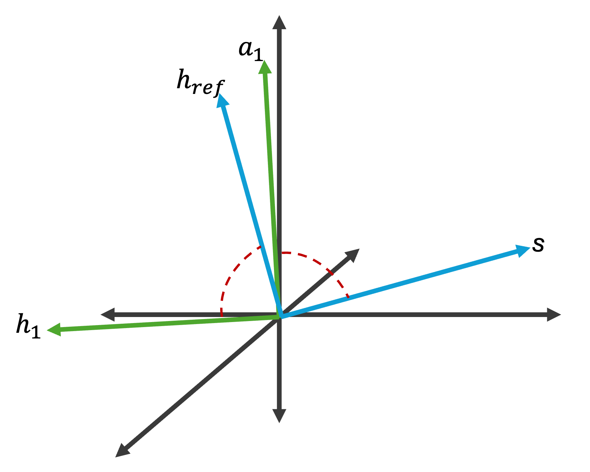

Executive Summary
-----------------
This module computes a reference attitude frame using the TRIAD method that simultaneously satisfies multiple pointing constraints. The TRIAD method determines spacecraft attitude by aligning two sets of vector observations: two non-parallel vectors in the body frame
(:math:`{}^\mathcal{B}\hat{h}_1` and :math:`{}^\mathcal{B}\hat{a}_1`)
and two targeted non-parallel vectors in the inertial frame. It creates a rotation matrix that prioritizes alignment of the body-frame direction :math:`{}^\mathcal{B}\hat{h}_1` with the targeted reference direction :math:`{}^\mathcal{N}\hat{h}_\text{ref}`, while accounting for all other constraints.

The mathematical details can be found in R. Calaon's PhD thesis, "Guidance, Control and Momentum Management of Spacecraft with Multiple Pointing Constraints".

This module uses FP32 (float) precision for all computations and message payloads.

Message Connection Descriptions
-------------------------------
The following table lists all the module input and output messages.

    Figure 1: ``TRIAD`` Illustration

.. list-table:: Module I/O Messages
    :widths: 25 25 50
    :header-rows: 1

    * - Msg Variable Name
      - Msg Type
      - Description
    * - attNavInMsg
      - NavAttMsgF32Payload
      - Input message containing current attitude and Sun direction in body-frame coordinates.
    * - bodyHeadingInMsg
      - BodyHeadingMsgF32Payload
      - (optional) Input message containing the body-frame direction :math:`{}^\mathcal{B}\hat{h}`. Alternatively, the direction can be specified as the parameter ``h1Hat_B``. When this input msg is connected, the parameter is ignored.
    * - inertialHeadingInMsg
      - InertialHeadingMsgF32Payload
      - (optional) Input message containing the inertial-frame direction :math:`{}^\mathcal{N}\hat{h}_\text{ref}`. Alternatively, the direction can be specified as the parameter ``hHat_N``. When this input msg is connected, the parameter is ignored.
    * - ephemerisInMsg
      - EphemerisMsgF32Payload
      - (optional) Input message containing the inertial position of a celestial object. Must be provided together with ``transNavInMsg``. If both ``inertialHeadingInMsg`` and ``ephemerisInMsg`` are connected, ``inertialHeadingInMsg`` takes precedence.
    * - transNavInMsg
      - NavTransMsgF32Payload
      - (optional) Input message containing the inertial position of the spacecraft. Must be connected together with ``ephemerisInMsg``.
    * - attRefOutMsg
      - AttRefMsgF32Payload
      - Output attitude reference message containing the reference MRP attitude.

Detailed Module Description
---------------------------
The TRIAD algorithm constructs a reference frame by:

1. Building a body-frame triad from the solar array drive direction :math:`\hat{a}_1` and the body heading :math:`\hat{h}_1`
2. Building an inertial-frame triad from the Sun direction and the inertial heading :math:`\hat{h}_\text{ref}`
3. Computing the rotation matrix :math:`[RN]` that maps between these two frames

The algorithm throws a runtime error if the Sun and inertial heading vectors are nearly parallel (SPE angle < 0.5 degrees), as the TRIAD method is singular in this configuration.

Module Assumptions and Limitations
----------------------------------
- The Sun and inertial heading vectors must not be parallel (SPE angle must be > 0.5 degrees)
- The solar array drive direction :math:`\hat{a}_1` must be non-zero (validated by ``TriadConfig``)
- The algorithm uses the two-phase initialization pattern: configuration parameters are validated during ``reset()``

User Guide
----------
The module uses the two-phase initialization pattern. Set public properties before calling ``reset()``::

    from xmera.fp32 import triadF32

    module = triadF32.Triad()
    module.modelTag = "triad"
    module.a1Hat_B = [1, 0, 0]   # solar array drive direction (required, must be non-zero)
    module.h1Hat_B = [0, 1, 0]   # body heading (optional if bodyHeadingInMsg is connected)
    # module.hHat_N = [0, 0, 1]  # inertial heading (optional if inertialHeadingInMsg or ephemerisInMsg is connected)

The module is configurable with the following parameters:

.. list-table:: Module Parameters
   :widths: 25 25 50
   :header-rows: 1

   * - Parameter
     - Default
     - Description
   * - ``a1Hat_B``
     - [0, 0, 0]
     - Solar array drive direction in body frame. Must be non-zero (validated by TriadConfig).
   * - ``h1Hat_B`` (optional)
     - [0, 0, 0]
     - Body-frame heading. Zero means use ``bodyHeadingInMsg`` instead.
   * - ``hHat_N`` (optional)
     - [0, 0, 0]
     - Inertial-frame heading. Zero means use ``inertialHeadingInMsg`` or ``ephemerisInMsg`` instead.
   * - ``celestialBodyInput`` (optional)
     - NotSun (0)
     - Set to Sun (1) when the celestial body pointed at is the Sun.
